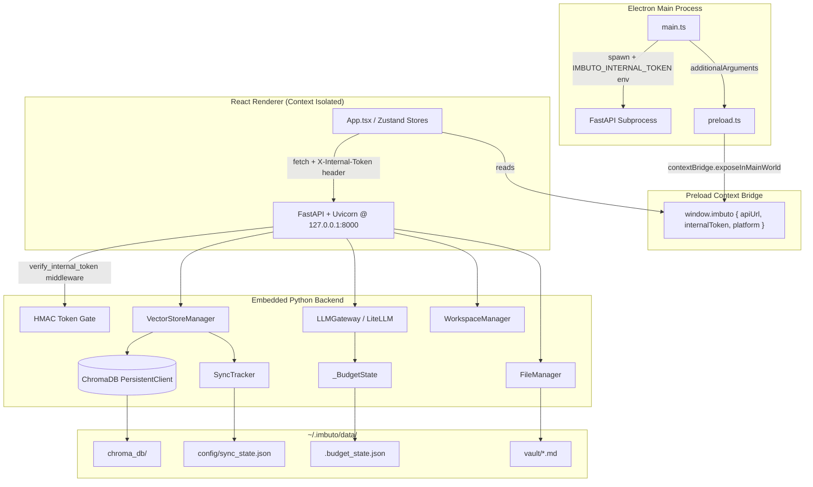

# IMBUTO Knowledge OS

A local-first desktop application for Markdown-based knowledge management with vector retrieval (RAG) and adaptive graph linking. Built on Electron, React, and an embedded FastAPI/ChromaDB backend.

---

## System Architecture



---

## Project Structure

```
imbuto/
├── frontend/
│   ├── electron/
│   │   ├── main.ts              # Electron main process, backend spawning
│   │   └── preload.ts           # Context bridge (window.imbuto)
│   ├── src/
│   │   ├── pages/               # EditorPage, GraphPage, QueryEnginePage
│   │   ├── shared/
│   │   │   ├── api/
│   │   │   │   └── imbutoClient.ts  # Centralized HTTP client
│   │   │   └── ui/              # Sidebar, FileTree, common components
│   │   ├── store/
│   │   │   └── useFileStore.ts  # Zustand state (file tabs, sync polling)
│   │   └── App.tsx
│   ├── package.json
│   └── vite.config.ts
├── personal_os/
│   ├── api/
│   │   └── main.py              # FastAPI app, lifespan, all endpoints
│   ├── config/
│   │   └── settings.py          # Pydantic BaseSettings (PKO_ env prefix)
│   ├── core/
│   │   ├── vector_store.py      # ChromaDB singleton, incremental sync
│   │   ├── llm_gateway.py       # LiteLLM multi-provider gateway
│   │   ├── orchestrator.py      # RAG query pipeline
│   │   ├── sync_tracker.py      # Atomic JSON sync state
│   │   ├── graph_cache.py       # Thread-safe similarity cache
│   │   ├── link_blacklist.py    # Thread-safe edge blacklist
│   │   ├── workspace.py         # Workspace registry management
│   │   ├── file_manager.py      # Vault file I/O
│   │   ├── translator.py        # i18n locale loader
│   │   ├── logger.py            # Centralized imbuto.* logger
│   │   └── utils.py             # atomic_json_write, compute_sha256
│   ├── locales/                 # JSON translation files
│   ├── path_resolver.py         # sys._MEIPASS / dev path resolution
│   ├── server.py                # Uvicorn entrypoint (dev mode)
│   └── requirements.txt
├── imbuto_backend.spec          # PyInstaller build specification
├── run_backend.py               # Production Uvicorn entrypoint
└── scripts/
    └── migrate_data.py          # Legacy data migration utility
```

---

## Security and Concurrency

### IPC Token Authentication

All HTTP communication between the Electron renderer and the FastAPI backend is authenticated using a process-scoped token:

1. `main.ts` generates a UUID v4 token at startup via `crypto.randomUUID()`.
2. The token is injected into the backend subprocess via the `IMBUTO_INTERNAL_TOKEN` environment variable.
3. The token is passed to the renderer via Electron's `additionalArguments` mechanism, parsed in `preload.ts`, and exposed as `window.imbuto.internalToken`.
4. Every API request includes an `X-Internal-Token` header.
5. The FastAPI middleware `verify_internal_token` validates incoming tokens using `hmac.compare_digest()` to prevent timing-based side-channel attacks.
6. The `/health` endpoint is explicitly exempted from authentication to support the Electron bootstrap health check.

### Atomic I/O and Concurrency Control

All mutable JSON state files (`sync_state.json`, `.budget_state.json`, `ignored_links.json`) are written atomically:

- A UUID-named temporary file is created in the same directory as the target.
- Data is serialized and flushed to the temporary file.
- `os.replace()` atomically swaps the temporary file into the target path.
- Cross-platform file locking is enforced via `filelock.FileLock` to prevent concurrent write corruption.

Thread safety is enforced via `threading.Lock` on all shared mutable state:

| Module            | Protected State                          |
|-------------------|------------------------------------------|
| `_BudgetState`    | `_total_cost` (read and write paths)     |
| `graph_cache`     | `_file_hashes`, `_sim_cache` dicts       |
| `link_blacklist`  | `_blacklist` set (read, add, remove)     |
| `SyncTracker`     | `_data` registry dict                    |

### ChromaDB WAL Persistence

On application shutdown (`will-quit` event), the Electron main process sends `SIGTERM` to the Python subprocess. The Uvicorn server handles this signal gracefully, invoking `VectorStoreManager.close()` which calls `client.clear_system_cache()` to flush the SQLite WAL journal before process exit.

---

## Local Development Setup

### Prerequisites

- Node.js >= 18.x
- Python >= 3.10
- npm >= 9.x

### Backend

```bash
cd /path/to/imbuto
python3 -m venv venv
source venv/bin/activate
pip install -r personal_os/requirements.txt
```

Create `~/.imbuto/.env` with required API keys (all optional, prefix `PKO_`):

```env
PKO_ANTHROPIC_API_KEY=sk-...
PKO_GEMINI_API_KEY=...
PKO_OPENAI_API_KEY=sk-...
PKO_GROQ_API_KEY=gsk_...
PKO_DEEPSEEK_API_KEY=...
PKO_COHERE_API_KEY=...
```

Run the dev backend:

```bash
python -m personal_os.server
# Binds to 127.0.0.1:8000
```

### Frontend

```bash
cd frontend
npm install
npm run dev
# Starts Vite dev server at http://localhost:5173
# Proxies /api and /health to http://localhost:8000
```

To launch the full Electron shell in development:

```bash
npm run dev
# vite-plugin-electron spawns Electron automatically
```

---

## Build and Release Pipeline

### 1. Bundle the Python Backend (PyInstaller)

```bash
source venv/bin/activate
pyinstaller imbuto_backend.spec --clean -y
```

The spec file (`imbuto_backend.spec`) configures:

- **Entry point:** `run_backend.py`
- **Data files:** `data/templates`, `personal_os/locales` (mapped to `locales/`), `litellm` data, `tiktoken` encodings
- **Hidden imports:** `filelock`, `regex`, `onnxruntime-cpu`, `tiktoken_ext`, plus all `chromadb` and `litellm` submodules
- **Excludes:** `nvidia`, `cuda` (not required for CPU-only inference)
- **Output:** `dist/imbuto_backend/` (self-contained directory)

### 2. Build the Frontend and Package with Electron

```bash
cd frontend
npm run build              # tsc + vite build
npx electron-builder --linux --dir   # Unpacked build for testing
npm run build:electron     # Full build (AppImage + deb)
```

`electron-builder` configuration in `package.json`:

- **Extra resources:** `../dist/imbuto_backend` is copied into the app's `resources/` directory.
- **Compiled output:** `dist/` (Vite) and `dist-electron/` (main.js, preload.mjs) are included in the final package.
- **Targets:** AppImage, deb (Linux).

### Preload Script

The Vite plugin compiles `electron/preload.ts` to `dist-electron/preload.mjs` (ESM output, matching `"type": "module"` in `package.json`). The `main.ts` `webPreferences.preload` path resolves to this file via `path.join(__dirname, 'preload.mjs')`.

---

## Environment and Configuration

All user data is persisted under `~/.imbuto/`:

```
~/.imbuto/
├── .env                              # API keys (PKO_ prefix)
├── data/
│   ├── vault/                        # Markdown knowledge base
│   ├── chroma_db/                    # ChromaDB persistent storage
│   ├── config/
│   │   └── sync_state.json           # Per-file SHA-256 hash registry
│   ├── .budget_state.json            # Daily LLM spend tracker
│   └── ignored_links.json            # Graph edge blacklist
└── logs/
    └── imbuto_ingestion.log          # Rotating application log
```

Configuration is managed by `personal_os/config/settings.py` using Pydantic `BaseSettings`. All fields accept environment variable overrides with the `PKO_` prefix (e.g., `PKO_VAULT_PATH`, `PKO_LOG_LEVEL`).

When running inside a PyInstaller bundle, `path_resolver.py` resolves read-only assets (templates, locales) from `sys._MEIPASS`, while all mutable state is externalized to `~/.imbuto/data/`.

---

## License

See repository for license terms.
